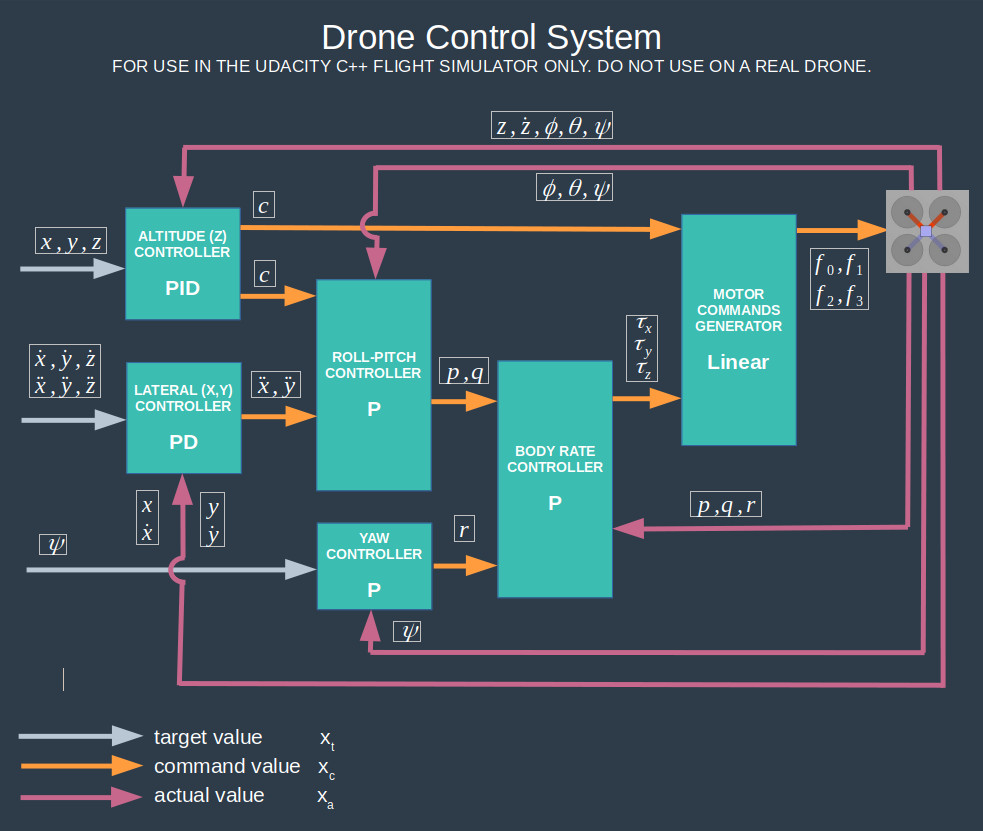
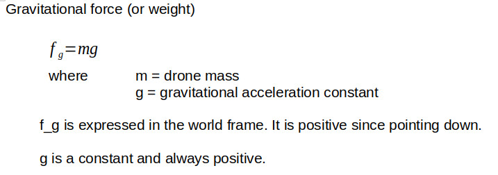
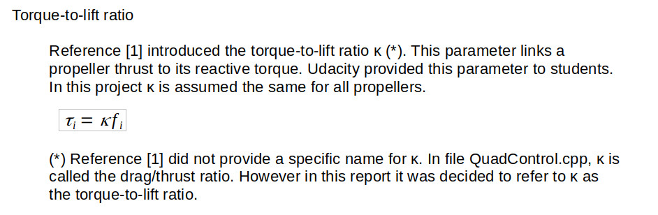

# Autonomous Drone Control System

# Overview

This project develops a control system for an autonomous drone, provides a C++ implementation of this system and performs adjustments of the system PID gains in a flight simulator.

The system developed in this project is based upon a methodology by SCHOELLIG and D’ANDREA [1][2].

This project is part of Udacity's Autonomous Flight Engineer Nanodegree [3]. This README serves as a final report for the project.

# Safety First!

1 - This project is educational only. The methodology used in this project was only used in the Udacity C++ flight simulator and not validated on a real drone.

2 - Only tune the PID gains of your drone by following the procedure prescribed by your drone’s manufacturer.

3 - Make sure you comply with your local regulations before flying a drone.

# Install & Run

1 - Clone this repository

    mkdir -p /drone/projects/control
    cd /drone/projects/control
    git clone https://github.com/martin0004/drone_control_system.git

2 - Install QTCreator and the GLUT libs

    sudo apt install qtcreator
    sudo apt install qtbase5-examples		# optional - qt examples
    sudo apt install qtbase5-doc-html		# optional - qt examples documentation
    sudo apt install freeglut3-dev

3 - Compile the project.

    Open QTCreator
    File > Open File Or Project > simulator/project/CPPSim.pro
    Click on tab Edit on the left side panel of QTCreator
    Right click on CPPSim > Run qmake
    Right click on CPPSim > Run

4 - You should now see a drone hover. Right click on the simulation to switch between scenarios.

5 - Look into file QuadControlParams.txt to find all control system gains. If you change a gain in this file and save it, the drone behavior will change in the simulation (no need to close the simulator, just update file QuadControlParams.txt). Try to find better system gains!

# [Optional] Udacity Starter Code

Udacity provided students with some starter code. This starter code can be installed with the following procedure.

    mkdir -p /drone/projects/control/udacity_starter_code
    cd /drone/projects/control/udacity_starter_code
    git clone https://github.com/udacity/FCND-Controls-CPP

# Udacity C++ Flight Simulator

The gains of the control system developed in this project were tweaked by flying a drone in a series of scenarios in the Udacity C++ flight simulator [4]. The tuning scenarios are described in section “Gain Tuning”.

The flight simulator itself is a small QT application. The flying area is about 5 m x 5 m and the scenarios last only a few seconds. A contextual menu allows to switch between scenarios and  display charts of the drone state variables.

 
 

| Command        | Action               |
|----------------|----------------------|
| MOUSE LEFT     | Rotate               |
| MOUSE LEFT + X | Pan                  |
| MOUSE LEFT + Z | Zoom                 |
| MOUSE RIGHT    | Open contextual menu |
| UP             | Apply force up.      |
| DOWN           | Apply force down.    |
| LEFT           | Apply force left.    |
| RIGHT          | Apply force right.   |
| W              | Apply force forward. |
| S              | Apply force back.    |
| C              | Clear graphs.        |
| R              | Reset simulation.    |
| SPACE          | Pause simulation.    |

# Symbols

Note. The symbols used in this project can be slightly different from the ones used in articles [1] and [2]. I tried my best to follow the notation from the lectures [3].

| Accronyms | Description                         |
|-----------|-------------------------------------|
| CG        | Drone center of gravity             |
| CCW       | Counterclockwise                    |
| CW        | Clockwise                           |
| wrt       | Abbreviation for “with respect to”. |

| Indices   | Description                                         |
|-----------|-----------------------------------------------------|
| x_t       | Variable target value (input to the control system) |
| x_c       | Variable command value (output of a controller)     |
| x_a       | Variable actual value (feedback from drone sensors) |
| x_dot     | Variable first time derivative                      |
| x_dot_dot | Variable second time derivative                     |
| x_bar     | Variable used to control a command value (“control knob” in lectures).|

| Variables          | Description                                                  |
|--------------------|--------------------------------------------------------------|
| c                  | Drone collective thrust (sum of all propeller thrusts)       |
| f_0, f_1, f_2, f_3 | Thrusts from each individual propeller                       |
| f_g                | Gravitational force (drone weight)                           |
| f_i                | Thrust from propeller i                                      |
| g                  | Gravitational acceleration                                   |
| I                  | Drone rotational inertia matrix  - body frame.               |
| I_xx, I_yy, I_zz   | Drone rotational inertia along axes x, y, z - body frame     |
| k_f                | Propeller force coefficient                                  |
| k_m                | Propeller torque (or moment) coefficient                     |
| K_p_x              | Proportional gain for variable x                             |
| K_i_x              | Integral gain for variable x                                 |
| K_d_x              | Derivative gain for variable x                               |
| m                  | Vehicle mass.                                                |
| p, q, r            | Drone body rates (rotational speeds) - body frame            |
| R                  | Rotation matrix from body frame to world frame               |
| R13                | Item in row 1 and column 3 of R                              |
| x, y, z            | Drone CG x, y, z locations - body frame                      |
| Ф, θ, Ψ            | Drone Euler angles (pitch, roll, yaw) - global frame         |
| κ                  | Propeller torque-to-thrust ratio                             |
| τ                  | Vector of moments about axes - body frame                    |
| τ_0, τ_1, τ_2, τ_3 | Reactive torque from each individual propeller               |
| τ_i                | Reactive torque from propeller i                             |
| τ_x, τ_y, τ_z      | Moment about x, y, z axis - body frame                       |
| ω                  | Vector of drone body rates - body frame                      |
| ω_0, ω_1, ω_2, ω_3 | Propellers rotation speeds                                   |
| ω_i                | Rotation speed from propeller i                              |
| ω_x, ω_y, ω_z      | Alternate notation for p, q, r. Used in the simulator graphs |

 

# Coordinate Frames

**Overview**

Note. The coordinate frames used in this project are the same as in the Udacity C++ simulator [4]. These coordinates are different from the ones in articles [1] and [2]. Some variable signs were changed in the control system to match the simulator convention.

The simulator used in this project contains two main coordinate frames: a world frame and a body frame.

**World Frame**

This frame is fixed to the ground and does not move during the simulation. It is a NED frame (North-East Down). The origin of this frame is on the ground, in the center of the simulation. Ground floor is z = 0. z - or altitude - goes down as we move upward.

**Body Frame**

This frame is attached to the drone and moves with the drone. It is an FRD frame (Front-Right-Down). The origin of this frame is at the drone CG.

 
 

**Rotation Matrix R**

Several transfer functions in this project use rotation matrix R, which is the rotation matrix from the body frame to the world frame [1]. R is a function of Euler angles Ф (pitch), θ (roll), φ (yaw).

 

 
 

Euler angles Ф, θ, φ are provided as input to any controller which needs to derive R internally.

# Methodology

**Define the control problem.**

**Define the vehicle model.**

- Drone geometry.
- Propellers convention.
- External loads.

**Develop a control system for the quadcopter.**

**Implement this control system in C++.**

**Tune the PID gains in Udacity’s C++ flight simulator.**

 

# Control Problem

A path planner computes a trajectory before the drone begins its mission. This trajectory consists of x-y-z locations in the world frame, target speeds and accelerations to reach these points and a desired yaw angle at each location. We want to “feed” these inputs to a control system which will transform these into individidual propeller thrusts (f0, f1, f2, f3). Drone on-board sensors, such as an IMU, can provide actual position, speed, acceleration and attitude (Euler angles) back to the control system through a feedback loop.

So the big problem to solve is: what’s inside the control system?

 
 

# Vehicle Model

**Drone Geometry**

The drone used in the simulation is an X-shaped quadrotor.

The drone arm L is the distance from the drone CG to a propeller rotation axis. All arms have the same L value.

Moment arm d is the component of L along the body frame x and y axes (see section “Coordinate Frames”). d is used in the moments calculation.

 
 

The drone mass m is assumed to be concentrated on a cube at the arms intersection (see gray square in image above). The inertia matrix I is assumed diagonal.

 
 

**Propellers Convention**

The propeller numbering used in this project is the same as in the simulator. Note that the numbering in the simulator is different from the numbering used in the lectures (the rear rotor order is swapped).

 
 

Each propeller has an orientation, either clockwise (CW) or counterclockwise (CCW). This orientation corresponds to the orientation - when looking from ABOVE the drone - the prop needs to turn to lift the drone.

Props 0 and 3 are CW.  
Props 1 and 2 are CCW.

A propeller rotation speed ω_i is assumed positive if it generates an upward lift.

ω_i > 0	upward lift  
ω_i < 0	downward lift

As we can see, the propellers rotation speeds use their own sign convention, which is **different from the drone body frame** (see section “Coordinate Frames”). To avoid confusion, propeller rotation speeds are always expressed with the propeller convention in this project, never in the body frame.

**External Loads**

The following loads are acting on the drone.

 
 

 
 

 
 

 
 

 
 

# Control System

**Control Architecture**

The control system developed in this project is made of 5 controllers and 1 motor commands generator.

 
 

**Command Limitations**

 

In order to improve drone stability in the simulator, some commands are limited within a min/max range of values. Checks are performed inside the controllers to ensure commands remain within these ranges.

 

| Commands                     | Symbols      | Min / Max  | Units    | Parameters       |
|------------------------------|--------------|------------|----------|------------------|
| Individual propeller thrust  | f_i          | 0.1 / 4.5  | N        | minMotorThrust   |
|                              |              |            |          | maxMotorThrust   |
| Longitudinal speed           | x_dot        | -5 / 5     | m/s      | maxSpeedXY       |
| Lateral speed                | y_dot        | -5 / 5     | m/s      | maxSpeedXY       |
| Vertical speed               | z_dot        | -2 / 5     | m/s      | maxAscentRate    |
|                              |              |            |          | maxDescentRate   |
| Longitudinal acceleration    | x_dot_dot    | -12 / 12   | m/s^2    | maxHorizAccel    |
| Lateral acceleration         | y_dot_dot    | -12 / 12   | m/s^2    | maxHorizAccel    |
| Rotation matrix elements (*) | R13, R23 (*) | -0.7 / 0.7 | no units | maxTitlAngle(**) |

 

(*) Used for controlling body rates p and q.  
(**) This parameter should have been called maxR since it is used to control rotation matrix elements and not angle values.

The following sections derive the transfer functions for each controller. Note that we remain in the time domain (no Laplace transforms in this project!).

 

**Motor Commands Generator**

 

 

 
 

**Body Rate Controller**

 

 

 
 

**Roll and Pitch Controller**

 

 

 
 

**Altitude Controller**

 

 

 
 

**Lateral Controller**

 

 

 
 

**Yaw Controller**

 

 

 
 

# C++ Implementation

**Drone Geometry**

Drone geometry parameters are available in file QuadControlParams.txt. Note that the variable names in this file can be slightly different than the ones used in this report.

**Control System**

The entire control system is implemented in the C++ class QuadControl. This class is available in file QuadControl.cpp.

| Controller               | Method                                |
|--------------------------|---------------------------------------|
| Control System           | QuadControl::RunControl()             |
| Motor Commands Generator | QuadControl::GenerateMotorCommands()  |
| Body Rate Controller     | QuadControl::BodyRateControl()        |
| Roll & Pitch Controller  | QuadControl::RollPitchControl()       |
| Altitude Controller      | QuadControl::AltitudeControl()        |
| Lateral Position Control | QuadControl::LateralPositionControl() |
| Yaw Controller           | QuadControl::YawControl()             |

**Command Limitations**

Parameters controlling command value limitations are available in file QuadControlParams.txt.

File MathUtils.h provides macro CONSTRAIN, which is useful for applying the command value limitations.

	a = CONSTRAIN(a,low,high)

Example

	z_c_dot = CONSTRAIN(z_c_dot,-2,5)

**Integral Error**

The QuadControl class provides static variable integratedAltitudeError for implementing the integration in the altitude controller.

**Scenario Configuration Files**

Configuration files for each scenario are available in directory /config.

# Gain Tuning

**Methodology**

The gain parameters of each controller were tuned using the Udacity C++ Flight Simulator [4].

The control system was tested using 5 flight scenarios. Each of these flight scenarios focused on adjusting specific parameters of the control system.

At the beginning of a scenario, controllers which were adjusted in a preceding scenario were activated, while controllers which were not tuned yet were inactive.

The tuning process was iterative. When progressing towards the more complex scenarios, it was often necessary to come back to simpler scenarios and adjust the gains again.

A green rectangle in the response diagram indicates the performance criteria was met.

 
 

**Scenario 1 - Hover**

|                                |                                                         |
|--------------------------------|---------------------------------------------------------|
| Scenario                       | 1_Intro                                                 |
| Initial conditions             | Drone starts 1 m above ground in a level position       |
| Objective                      | Adjust drone mass parameter so drone hovers             |
| Parameters (Controllers)       | m (motor commands generator)                            |
| Before tuning                  |        |
| After tuning                   |        |
| Performance criteria / Results |  |

**Scenario 2 - Attitude Control**

|                                |                                                         |
|--------------------------------|---------------------------------------------------------|
| Scenario                       | 2_AttitudeControl                                       |
| Initial conditions             | Drone starts 1 m above ground with roll angle of 30 deg |
| Objective                      | Stabilize drone in level position                       |
| Parameters (Controllers)       | K_p_p, K_p_q, K_p_r (Body rate controller)              |
|                                | K_p_bank (Roll & pitch controller)                      |
| Before tuning                  |        |
| After tuning                   |        |
| Performance criteria / Results |  |

**Scenario 3 - Position & Yaw Control**

|                                |                                                         |
|--------------------------------|---------------------------------------------------------|
| Scenario                       | 3_PositionControl                                       |
| Initial conditions             | 2 drones start at 1 m above ground.                     |
|                                | Drone 1 has no yaw. Drone 2 has a 45 deg yaw.           |
| Objective                      | Move both drones 0.5 m forward and bring yaw to 0.      |
| Parameters (Controllers)       | K_p_x, K_d_x (Lateral controller)                       |
|                                | K_p_y, K_d_y (Lateral controller)                       |
|                                | K_p_z, K_d_z (Altitude controller)                      |
|                                | K_p_yaw (Yaw controller)                                |
| Before tuning                  |        |
| After tuning                   |        |
| Performance criteria / Results |  |

**Scenario 4 - Imperfect Drones Control**

|                                |                                                         |
|--------------------------------|---------------------------------------------------------|
| Scenario                       | 4_Nonidealities                                         |
| Initial conditions             | 3 drones start at 1 m above ground.                     |
|                                | Drone 1 is too heavy.                                   |
|                                | Drone 2 is an ideal drone.                              |
|                                | Drone 3 has its CG offset to the right.                 |
|                                |                                   |
| Objective                      | Move both drones 2 m forward and reach a target.        |
| Parameters (Controllers)       | K_i_z (Altitude controller)                             |
| Before tuning                  |        |
| After tuning                   |        |
| Performance criteria / Results |  |

**Scenario 5 - Trajectory Following**

|                                |                                                         |
|--------------------------------|---------------------------------------------------------|
| Scenario                       | 5_TrajectoryFollow                                      |
| Initial conditions             | 2 drones start below a target trajectory                |
| Objective                      | Follow the trajectory                                  |
| Parameters (Controllers)       | All                                                     |
| After tuning                   |        |
| Performance criteria / Results |  |

 

# Possible improvements

- Print vehicle state variables to some kind of log file for vizualisation. There seems to be a /log directory in the simulator directory structure, but I couldn’t figure out how to generate log data… To be investigated.

- This project came with some extra (optional) scenarios which I didn’t have time to explore. Some of these extra scenarios involve several drones. To be explored...

- Build a dashboard to help with tuning gains (using the Python dash library, maybe?). This dashboard could contain the following.

    - A window displaying the live simulation.
    - A table displaying the current gain values. Values could be changed in this table and file QuadControlParams.txt would be saved automatically. The user would see the changes applied live on the drone behavior in the simulation window.
    - Charts build build live, similar to the graphs which already exist in the simulator. However these charts would not be deleted when the simulation loop restarts. The curves would accumulate, thus making it easy to visualize the impact of changing a gain value on the drone behavior.

- Perform tuning using reinforcement learning (RL).

    - Wrap the simulator in some kind of bigger program which contains an RL model.
    - This RL program would set some gain values and be rewarded if the drone meets some flight performance criteria.
    - By default, the simulator already contains the 5 scenarios described in this project. Each of these scenarios has 1-3 performance criteria. As a starting point, the RL could run these 5 scenarios and use these performance criteria. New performance criteria could be defined if needed. Also brand-new scenarios could be invented. Eventually, the RL program could even generate its own scenarios and criteria… The sky’s the limit!

# References

[1] SCHOLLIG, A. D’ANDREA, R. et al, Feasiblity of Motion Primitives for Choreographed Quadrocopter Flight, 2011, http://flyingmachinearena.org/wp-content/publications/2011/schoellig_feasibility_of_motion_primitives.pdf

[2] SCHOLLIG, A. D’ANDREA, R. et al, Feed-Forward Parameter Identification for Precise Periodic Quadrocopter Motions, 2012, http://www.dynsyslab.org/wp-content/papercite-data/pdf/schoellig-acc12.pdf

[3] Udacity's Autonomous Flight Engineer Nanodegree. https://www.udacity.com/course/flying-car-nanodegree--nd787

[4] Udacity, C++ Flight Simulator, github, https://github.com/udacity/FCND-Controls-CPP

[5] Udacity's Autonomous Flight Engineer Nanodegree, Course 3 - Controls, Lesson 1 - Vehicle Dynamics, Section 7 - Rotor Physics.

[6] Knowledge, What is kappa in project?, https://knowledge.udacity.com/questions/500895

